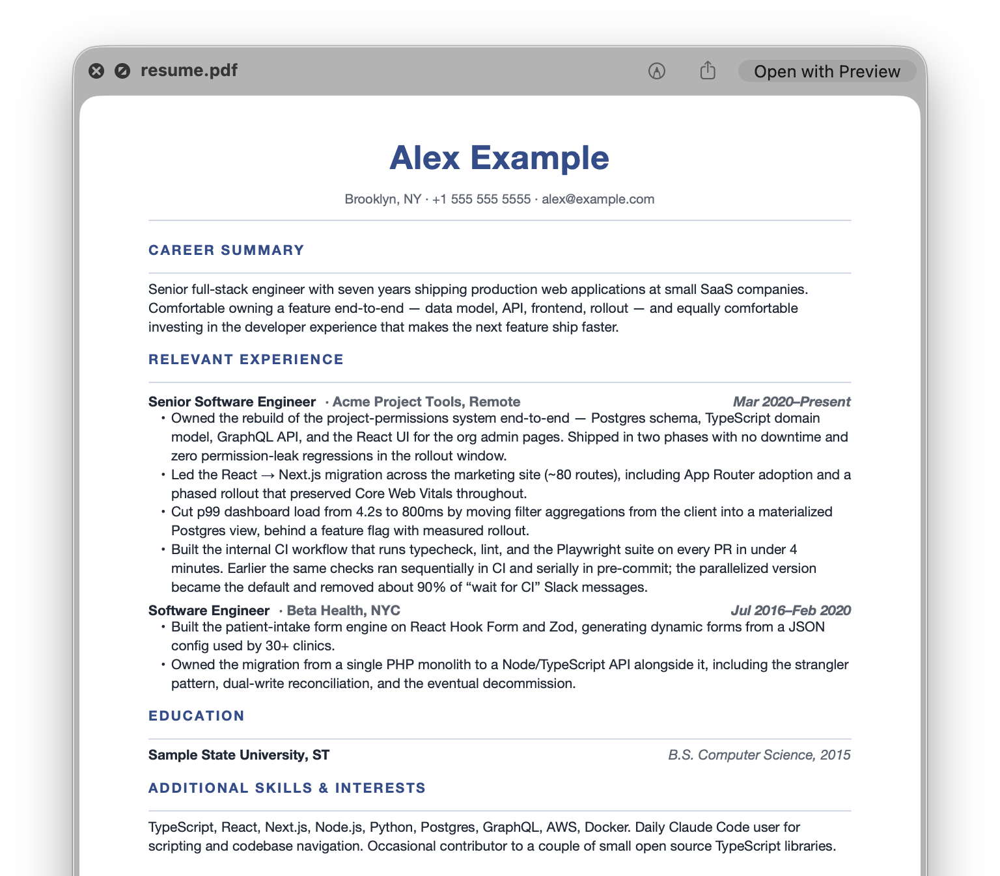
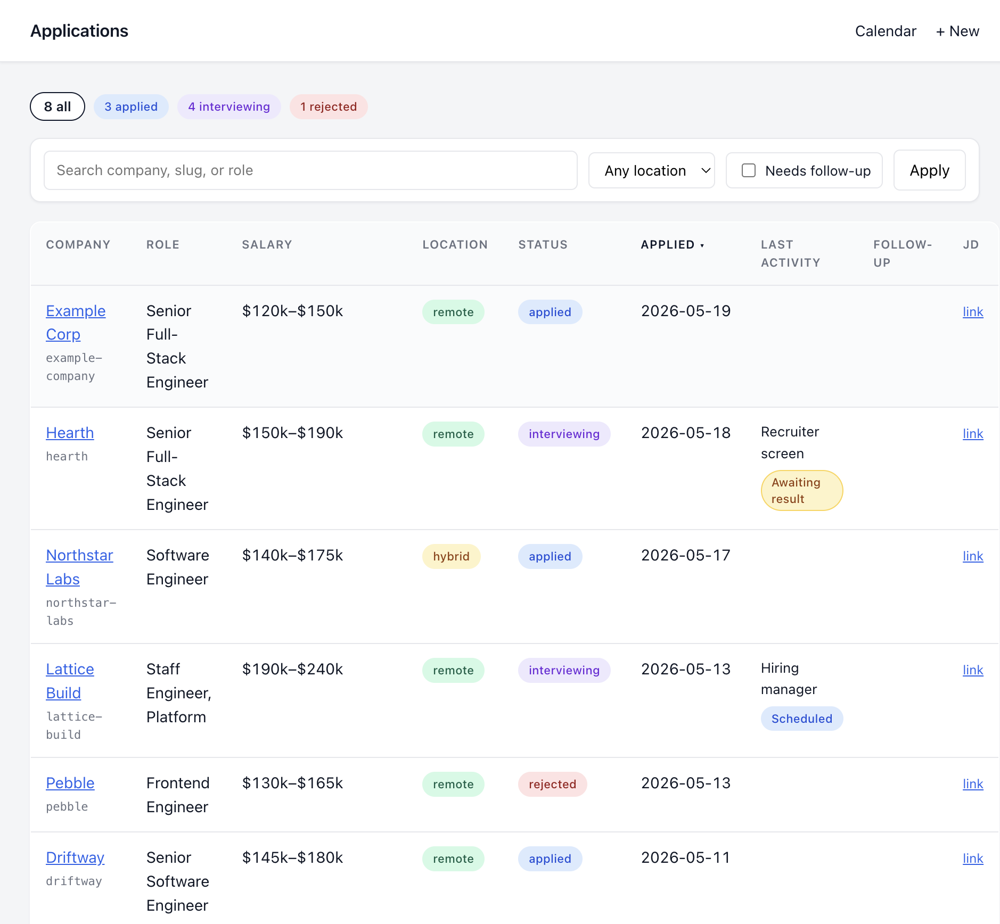
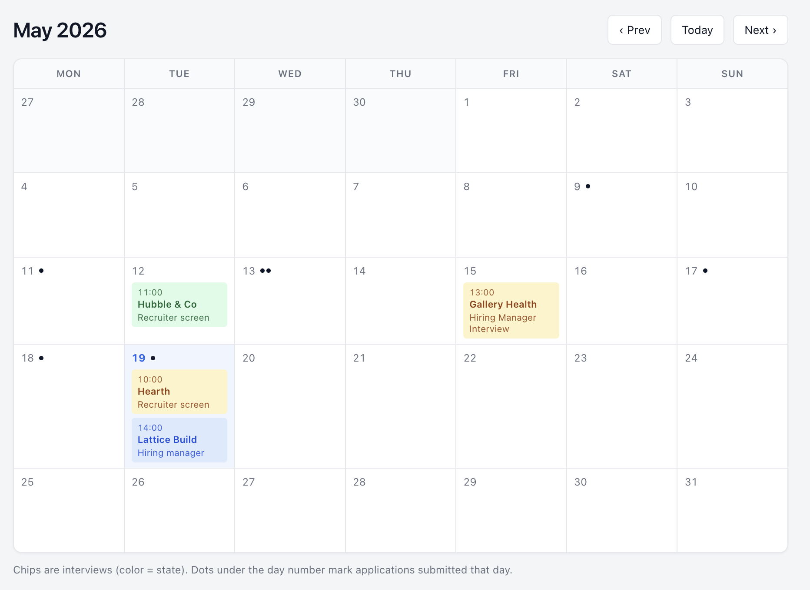
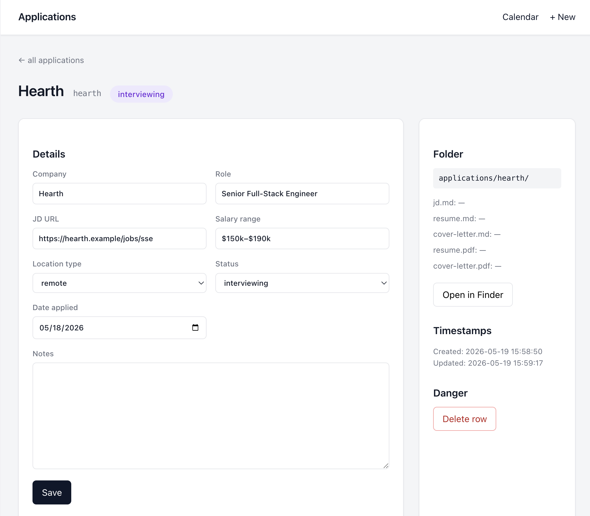

# claude-resume-workflow

A personal job-search workshop, driven by [Claude
Code](https://www.anthropic.com/claude-code). Markdown master resume,
pre-tailored angle templates for different role-types, voice and style
guides, a story bank, a Typst PDF pipeline, and a local SQLite tracker
with a small Flask dashboard.

You drop in your existing resume, ask Claude to set things up, then
paste a JD whenever a new application comes along and get back a
tailored draft and a PDF — with the application logged in the tracker.

> Background and the rationale behind the design: [The Job-Search
> Workshop I Built With
> Claude](https://callanable.com/blog/tailoring-resumes-with-claude).



---

## What you get

- **A markdown source of truth** (`master.md`) for everything you've
  ever done. Tailoring becomes *choosing*, not re-typing.
- **Angle templates** (`angles/*.md`) — pre-pruned views of your master
  aimed at different *kinds* of roles. You generate these once with
  Claude's help, then reuse them across applications.
- **Style guides** (`style-guides/`) — voice, framing, and editorial
  rules in plain English. Claude reads them every session.
- **A story bank** (`style-guides/story-bank.md`) — concrete
  situation → action → outcome anecdotes. Primary source for cover-letter
  paragraph 2.
- **A consistent PDF render** via [Typst](https://typst.app/) — no Word,
  no Pages, no Google Docs. Sub-second compile.
- **A local SQLite tracker** with a Flask dashboard, calendar view, and
  CLI that Claude can drive. Folder on disk is the source of truth: if
  the application folder exists, the tracker row exists.

---

## Prerequisites

- **[Claude Code](https://docs.claude.com/en/docs/claude-code/overview)**
  — this whole workflow is designed around it. Could be adapted to work
  with Claude in the browser, but the loop is much tighter in the CLI.
- **`pandoc`** — converts the resume markdown into the format Typst expects.
- **`typst`** — renders the PDF.
- **Python 3.10+** with **Flask** — runs the tracker dashboard.

On macOS:

```sh
brew install pandoc typst
python3 -m venv .venv && source .venv/bin/activate
pip install flask
```

On Linux:

```sh
sudo apt install pandoc          # or your package manager
# Typst: see https://github.com/typst/typst#installation
python3 -m venv .venv && source .venv/bin/activate
pip install flask
```

A virtualenv is the simplest way to keep Flask out of your system
Python. If you'd rather install globally, `pipx install flask` or
`pip install --user flask` both work. `build.sh` and `tracker.py` will
pick up Flask from any of those — they just call `python3`.

---

## Quickstart

```sh
git clone https://github.com/callanable/claude-resume-workflow.git
cd claude-resume-workflow
brew install pandoc typst        # or platform equivalent
python3 -m venv .venv && source .venv/bin/activate && pip install flask
claude                           # opens Claude Code in this repo
```

Then in the Claude Code prompt:

> Help me set up my resume. Here's my current one: *(paste your resume
> text, or drag in a PDF)*.

Claude reads [`CLAUDE.md`](CLAUDE.md) and walks you through filling in
`master.md`, generating angle files for the kinds of roles you're
targeting, and (optionally) building out your story bank.

After setup, a typical session is:

> Here's a JD — please tailor.

About a minute later there's a draft at
`applications/<company-slug>/resume.md` waiting for you to read, tweak,
and approve before the PDF gets built.

---

## First-run setup, in more detail

When you open Claude Code in this repo for the first time, `master.md`
is a skeleton, the style guides have empty `Personalize` sections, and
`angles/` only contains a README and an empty example file.

The first-run flow is:

1. **Hand Claude your current resume.** Paste, attach a PDF, or
   describe your career out loud — whatever's easiest.
2. **Claude fills in `master.md`.** It'll migrate every role, every
   accomplishment, every credential into the existing structure. This
   is the kitchen-sink doc — include everything you might ever want to
   mention.
3. **Claude personalizes the style guides.** Both
   [`resume-style-guide.md`](style-guides/resume-style-guide.md) and
   [`cover-letter-style-guide.md`](style-guides/cover-letter-style-guide.md)
   have `## Personalize` sections at the bottom. Claude asks you the
   questions in those sections (your target roles, words that don't
   sound like you, calibration notes) and fills them in.
4. **Claude generates your angle files.** Based on the role types you
   identified, it drafts 3–4 files under `angles/` — e.g. `frontend.md`,
   `staff-eng.md`, `data-platform.md`. Each is a pruned and reframed
   view of master, leading with what hiring managers for *that*
   role-type care about.
5. **(Optional) Bootstrap your story bank.** Claude can interview you
   for 3–4 headline stories and a handful of shorter detail stories,
   each as a situation → action → outcome paragraph in
   [`style-guides/story-bank.md`](style-guides/story-bank.md). You can
   do this now or wait until a cover letter forces the question.

Read each file Claude generates and tweak it in your voice. The whole
point is that these are *yours* — Claude's draft is the starting line,
not the finish line.

---

## The day-to-day workflow

Once you're set up, every job application looks the same:

1. **Paste a JD** into a Claude Code session: *"Here's a JD — please
   tailor."*
2. **Claude picks an angle** from `angles/` and tells you why.
3. **Claude cross-references master**, prunes what doesn't fit, and
   drafts a tailored resume at `applications/<company-slug>/resume.md`.
4. **Claude saves the verbatim JD** to `applications/<company-slug>/jd.md`
   and registers the application in the tracker.
5. **You review the markdown** — tweak in your voice, push back on
   anything that doesn't land.
6. **Approve, then build the PDF:**
   ```sh
   ./build.sh applications/<company-slug>/resume.md
   ```
   The PDF lands next to the markdown, and the tracker row gets bumped
   to `applied`.

Cover letters work the same way — `applications/<company-slug>/cover-letter.md`,
build with the same command.

The full numbered checklist Claude reads every session lives in
[`CLAUDE.md`](CLAUDE.md). Edit it to fit how *you* work.

---

## The tracker dashboard

```sh
python3 tracker.py serve
# → http://127.0.0.1:5050
```



A small Flask UI on top of a SQLite database with two tables:
`applications` and `interview_rounds`. Filter and sort by status,
salary range, location type.



A calendar view shows upcoming interviews (chips colored by state) and
a dot under the day-number for every application submitted that day —
a visible record of effort even on quiet days.



Each application gets a detail page with editable fields, the folder
path on disk (with a one-click Open in Finder), timestamps, and the
status of every file under `applications/<slug>/`.

The CLI is what Claude actually uses. When you mention something that
changes state in a session — *"Acme scheduled a recruiter screen for
Tuesday"* — Claude calls the CLI:

```sh
python3 tracker.py interview acme --stage "Recruiter screen" --date 2026-05-26T14:00
python3 tracker.py status beta rejected
python3 tracker.py status gamma offer
```

Full CLI reference in [`README-tracker.md`](README-tracker.md).

The tracker DB is **gitignored by default** so your application history
stays local. If you want git history as backup (like the original
author does), either remove `tracker.db` from `.gitignore` and keep
your fork private, or push to a private repo.

---

## Customizing the visual template

All visual styling lives in
[`template/resume.typ`](template/resume.typ). The top of that file
documents the main knobs — fonts, sizes, colors, page margins, the
heading layouts.

Compile is sub-second, so iteration is fast: edit the template, re-run
`./build.sh applications/<slug>/resume.md`, reopen the PDF. Typst docs:
<https://typst.app/docs/>.

---

## Repo layout

```
claude-resume-workflow/
├── CLAUDE.md                       # Workflow instructions for Claude
├── README.md                       # You are here
├── README-tracker.md               # Tracker CLI / UI reference
├── master.md                       # Your master resume (kitchen-sink)
├── angles/
│   ├── README.md                   # What angles are, how to make them
│   └── fullstack-example.md        # Worked example angle (delete or replace)
├── applications/
│   └── example-company/            # Fictional example: jd, resume, letter
├── style-guides/
│   ├── tailoring-prompt.md         # Resume tailoring process prompt
│   ├── cover-letter-prompt.md      # Cover letter drafting prompt
│   ├── resume-style-guide.md       # Resume voice/style rules
│   ├── cover-letter-style-guide.md # Cover letter voice/style rules
│   └── story-bank.md               # Situation→action→outcome stories
├── template/
│   └── resume.typ                  # Typst PDF template
├── tracker/                        # Flask app + SQLite schema
├── scripts/                        # backfill + helpers
├── build.sh                        # markdown → PDF + tracker sync
└── tracker.py                      # tracker CLI entrypoint
```

---

## Privacy notes

By default, the `.gitignore` keeps the personal stuff out of git:

- `tracker.db` — your application history, salaries, interview notes.
- `applications/*` — everything except `example-company/`.
- `*.pdf` — generated PDFs.
- `.claude/` — Claude Code's local settings.

If you fork this repo for your own use, your master resume, angles, and
style guides **will** end up in git. Most people are fine with that —
they're the kind of thing you'd put on LinkedIn anyway — but if you want
to keep them private, push to a private repo.

---

## Credits

Built by Callan. The rationale, design tradeoffs, and what it actually
feels like to use this every day are written up here: [The Job-Search
Workshop I Built With
Claude](https://callanable.com/blog/tailoring-resumes-with-claude).

MIT licensed — fork it, gut it, make it yours.
